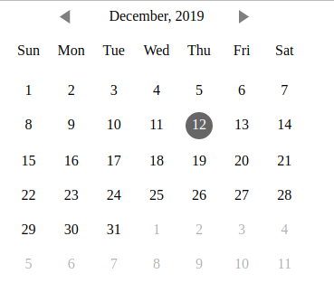
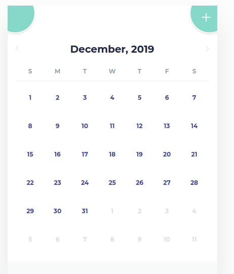

# New Calendar 
  Inspire from jackducasse/caleandar and I fork to [My Reposite] (https://github.com/rachmanzz/calendar) that make A lightweight, library independent JavaScript calendar.

Default theme using jackducasse/caleandar theme, but you can make custom theme by your own. You don't need follow default theme structure, you can make by your own structure but you need extra time to write your own thema in Element Calendar.

## How to
To call instance Element Calendar like this:
        
```javascript
    var element = document.getElementById('calendar')
    var calendar = new ElementCalendar(new Date()
    // or 
    var calendar = new ElementCalendar(new Date(2019, 10, 1)
    calendar.create(element) // to create calandar 

```

Extra setting is possible at Element Calendar

```javascript
    var calendar = new ElementCalendar(new Date(), { /** setting **/ } )
```

- Add Extra Style using ```styles``` object
    
    1. date
    2. currentMonth
    3. prevMonth
    4. nextMonth
    5. today
    5. selectedDay

- Add custom tag and style using ```templetes``` object
    1. date
    2. currentMonth
    3. prevMonth
    4. nextMonth

- add event click by ``onclick`` object
    1. date


### Own Style and structure
In this case you can inject your own html template, no worry about default html structure.

```javascript
    var element = document.getElementById('calendar')
    var calendar = new ElementCalendar(new Date()
    var custom = [
        {
            node: 'div', className: ['class'],
            attr: [ { name: 'title', value: 'Menu' } ],
            onlick: function () { /* click event */ },
            child: [ { node: 'div', className: ['class'] } ]
        }
    ]
    calendar.custom(custom).create(element) // to create calandar 

```

### Learn how Custom template work

1. node is html item tag like div, a, img and etc
2. className is class array
3. attr is html tag attribute
4. onclick is event click in your html tag
5. child to inject child html tag to your current html tag




theme from https://codepen.io/eliza-rjb/pen/xmbEWX



